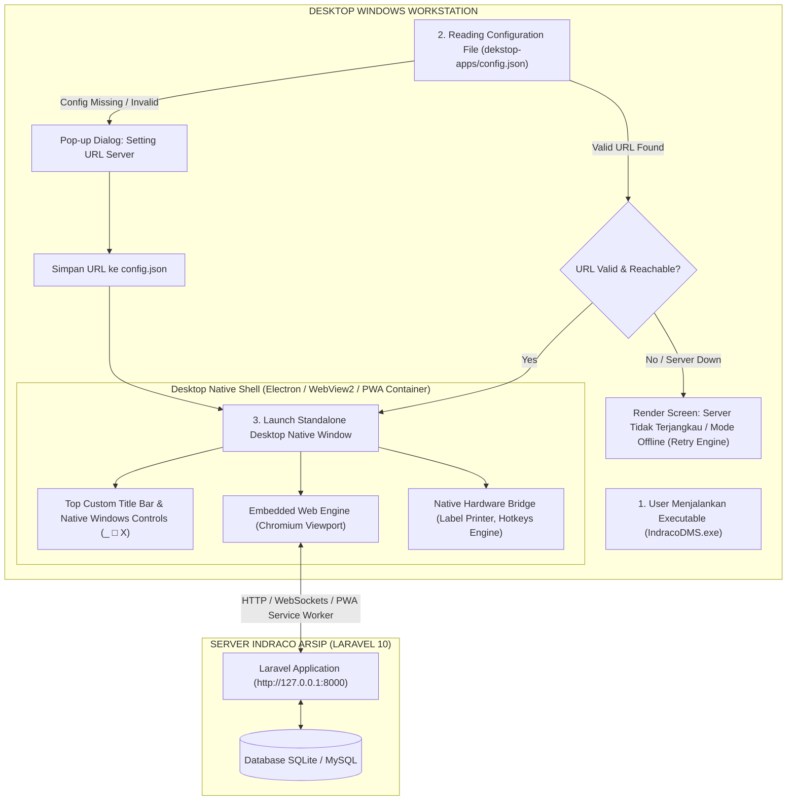
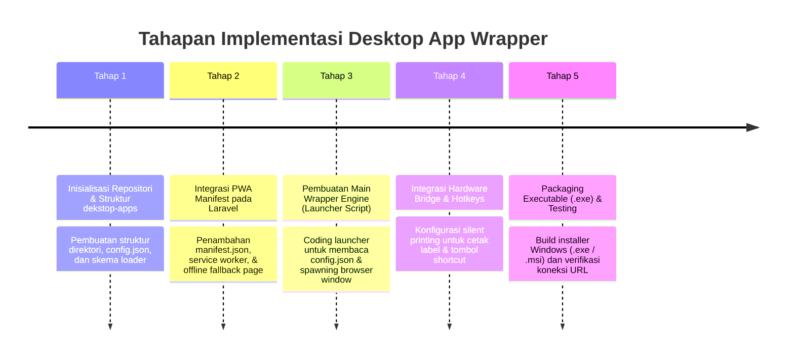

# Catatan Perencanaan Implementasi: Aplikasi Desktop Client (PWA / Native Wrapper) untuk INDRACO Arsip DMS

Dokumen ini berisi spesifikasi teknis, arsitektur antarmuka, struktur skema konfigurasi dinamis, serta alur kerja (*workflow*) pembuatan **Aplikasi Desktop Client (PWA / Native Wrapper Container)** untuk sistem **INDRACO Arsip (Document Management System - PT Indraco)**.

Aplikasi Desktop ini dirancang untuk membungkus (*wrap*) dan menjalankan aplikasi web **INDRACO Arsip (Laravel 10)** ke dalam jendela aplikasi desktop mandiri (*standalone desktop app*) pada sistem operasi Windows, yang dilengkapi dengan **file konfigurasi eksternal** untuk menentukan URL aplikasi sasaran secara fleksibel (*dynamic URL binding*) serta prosedur deployment/kompilasi menjadi berkas **`.exe`**.

---

## 1. Ringkasan & Tujuan Utama

### A. Latar Belakang & Tujuan
Untuk meningkatkan efisiensi operasional bagi pengguna (khususnya Role **PIC Departemen** & **PIC Gudang**), diperlukan aplikasi desktop khusus yang:
1. **Dapat Diberjalankan Langsung dari Desktop Windows** tanpa membuka web browser secara manual.
2. **Memiliki Fleksibilitas Konfigurasi Server**: URL sasaran (*target URL*) disimpulkan melalui file konfigurasi lokal (`config.json`), sehingga dapat dengan mudah diarahkan ke environment `Development` (`http://127.0.0.1:8000`), `Staging`, maupun `Production` (`https://dms.indraco.com`) tanpa perlu melakukan kompilasi ulang (*rebuild*) aplikasi.
3. **Pengalaman Pengguna Aplikasi Desktop Murni**: Bebas dari elemen antarmuka browser bawaan seperti address bar, bookmark bar, tab browser luar, serta memiliki window frame bergaya desktop workstation (Delphi / VB Enterprise Style).
4. **Integrasi Printer & Perangkat**: Mendukung akses langsung ke perangkat keras seperti thermal label printer untuk cetak stiker box arsip.

---

## 2. Arsitektur Sistem & Alur Kerja Wrapper (Mermaid Diagram)



---

## 3. Spesifikasi Berkas Konfigurasi (`config.json`)

Aplikasi Desktop ini dilengkapi dengan file konfigurasi eksternal berformat **JSON** yang diletakkan pada direktori aplikasi (`c:\laragon\www\#Project2026\indraco-arsip-laravel-10\dekstop-apps\config.json`). File ini dibaca saat pertama kali aplikasi desktop diluncurkan.

### Skema Struktur `config.json`:

```json
{
  "app_name": "INDRACO DMS Desktop Client",
  "version": "1.0.0",
  "server_config": {
    "target_url": "http://127.0.0.1:8000",
    "fallback_url": "http://localhost:8000",
    "connection_timeout_ms": 5000,
    "auto_reconnect": true,
    "reconnect_interval_ms": 3000
  },
  "window_settings": {
    "title": "INDRACO DMS - Workstation Desktop Edition",
    "width": 1366,
    "height": 768,
    "min_width": 1024,
    "min_height": 600,
    "center_on_launch": true,
    "maximized_on_start": true,
    "frameless": false,
    "always_on_top": false,
    "resizable": true
  },
  "hardware_integration": {
    "enable_direct_printing": true,
    "default_label_printer": "TSC TTP-244 Pro",
    "silent_print": false
  },
  "preferences": {
    "auto_launch_on_startup": false,
    "minimize_to_tray": true,
    "clear_cache_on_exit": false
  }
}
```

### Penjelasan Parameter Konfigurasi Utama:
- **`target_url`**: URL utama server Laravel INDRACO Arsip yang akan dibuka oleh aplikasi desktop.
- **`connection_timeout_ms`**: Batas waktu toleransi respon server sebelum aplikasi menampilkan layar *Offline / Server Connection Issue*.
- **`maximized_on_start`**: Menentukan apakah jendela dibuka langsung dalam mode *Maximized Window*.
- **`minimize_to_tray`**: Menyembunyikan aplikasi ke System Tray Windows saat tombol minimize/close diklik.

---

## 4. Karakteristik & Fitur Utama Aplikasi Desktop Client

### 1. Dynamic URL Loader & Setting GUI Dialog
- Ketika file `config.json` tidak ditemukan atau properti `target_url` kosong, aplikasi desktop akan otomatis memunculkan **GUI Setting Dialog** sederhana tempat pengguna/teknisi IT dapat menginput URL server dan menyimpannya.

### 2. Standalone Application Window (Tanpa Address Bar / URL Browser)
- Mengisolasi antarmuka dari fitur browser biasa (seperti URL Bar, Tab Browser Tambahan, Tombol Back Browser) sehingga pengguna merasa seperti menggunakan aplikasi desktop asli (Delphi / WinForms).

### 3. Progressive Web App (PWA) Manifest & Offline Shell
- Mengintegrasikan PWA Service Worker pada proyek Laravel untuk melakukan *caching* aset statis (CSS, JavaScript, Ikon Font Inter/JetBrains Mono).
- Menampilkan halaman pemberitahuan yang rapi saat koneksi jaringan ke server terputus dengan tombol `🔄 Coba Hubungkan Kembali`.

### 4. Direct Label Printer Integration (Native Hardware Bridge)
- Memungkinkan tombol `Cetak Label (F9)` langsung mengirim perintah ke printer stiker terhubung (*Thermal Label Printer*) tanpa memicu dialog cetak browser bawaan (*silent printing* opsional).

### 5. Windows System Tray & Hotkey Support
- Ikon aplikasi muncul di area **Windows System Tray** (pojok kanan bawah taskbar Windows) dengan opsi menu klik-kanan:
  - `🖥️ Buka Workstation`
  - `⚙️ Konfigurasi URL Server`
  - `🔄 Reload Application`
  - `❌ Keluar`

---

## 5. Arsitektur Opsi Pilihan Teknologi Wrapper

Terdapat 3 (tiga) opsi teknologi utama yang disiapkan dalam rencana implementasi ini:

| Komponen / Opsi | Opsi A: PWA Native Wrapper (Web2App / MS Edge App) | Opsi B: Electron.js Desktop Wrapper | Opsi C: Tauri Desktop Wrapper (Rust + WebView2) |
|:---|:---|:---|:---|
| **Ukuran Executable** | Sangat Kecil (~2 MB) | Sedang (~60-80 MB) | Sangat Ringan (~5 MB) |
| **Penggunaan RAM** | Sangat Hemat (~50 MB) | Sedang (~150 MB) | Hemat (~40 MB) |
| **File Config Reader** | Mendukung via Launcher Script / Native Shell | Mendukung via Node.js `fs` Module | Mendukung via Rust `std::fs` |
| **Direct Printing** | Terbatas pada API Browser | Mendukung Penuh (*Silent Print*) | Mendukung Penuh via Native Plugin |
| **Kemudahan Install** | Tanpa Install Engine Tambahan | Standalone Setup Executable | Standalone Setup Executable |

> [!RECOMMENDATION]
> **Rekomendasi Utama**: Menggunakan **Opsi B (Electron.js)** atau **Native WebView2 Wrapper Executable** karena memiliki fleksibilitas tertinggi dalam membaca file `config.json` lokal, mengontrol ukuran window, serta mendukung pencetakan label box secara otomatis (*silent label print*).

---

## 6. Rencana Tahapan Implementasi (Implementation Roadmap)



### Rincian Langkah Implementasi:

1. **Langkah 1 (Folder & Config Setup)**:
   - Direktori `dekstop-apps/` dikonfigurasi sebagai rumah bagi seluruh file launcher desktop, file ikon (`app-icon.ico`), dan file `config.json`.

2. **Langkah 2 (PWA Module di Laravel)**:
   - Menambahkan file `public/manifest.json` dan `public/sw.js` pada repositori Laravel untuk mengizinkan aplikasi dikenali sebagai PWA compliant app.

3. **Langkah 3 (Configuration Reader Implementation)**:
   - Membuat script launcher utama (misal `main.js` atau `app_launcher.bat`/`app.exe`) yang membaca nilai `target_url` pada `config.json` saat diluncurkan:
     ```javascript
     const fs = require('fs');
     const path = require('path');

     // Read configuration
     const configPath = path.join(__dirname, 'config.json');
     let config = { server_config: { target_url: 'http://127.0.0.1:8000' } };

     if (fs.existsSync(configPath)) {
         config = JSON.parse(fs.readFileSync(configPath, 'utf8'));
     }

     const targetUrl = config.server_config.target_url;
     // Launch Window with targetUrl...
     ```

4. **Langkah 4 (Packaging & Distribution)**:
   - Melakukan bundling menjadi satu berkas siap pakai `INDRACO_DMS_Setup.exe`.

---

## 7. Panduan Deployment & Kompilasi ke Berkas Executable (.exe)

### 7.1 Kompilasi Menggunakan Electron-Builder (`.exe` Installer & Portable)

1. **Konfigurasi Dependencies (`package.json`)**:
   Di dalam folder `dekstop-apps/`:
   ```json
   {
     "name": "indraco-dms-desktop",
     "version": "1.0.0",
     "description": "INDRACO DMS Workstation Desktop Client",
     "main": "main.js",
     "scripts": {
       "start": "electron .",
       "build:win": "electron-builder --win nsis",
       "build:portable": "electron-builder --win portable"
     },
     "devDependencies": {
       "electron": "^28.0.0",
       "electron-builder": "^24.9.0"
     },
     "build": {
       "appId": "com.indraco.dms.desktop",
       "productName": "INDRACO DMS Workstation",
       "directories": {
         "output": "dist"
       },
       "files": [
         "**/*"
       ],
       "extraResources": [
         {
           "from": "config.json",
           "to": "config.json"
         }
       ],
       "win": {
         "icon": "assets/icon.ico",
         "target": [
           {
             "target": "nsis",
             "arch": ["x64"]
           },
           {
             "target": "portable",
             "arch": ["x64"]
           }
         ]
       },
       "nsis": {
         "oneClick": false,
         "allowToChangeInstallationDirectory": true,
         "createDesktopShortcut": true,
         "createStartMenuShortcut": true,
         "shortcutName": "INDRACO DMS Workstation"
       }
     }
   }
   ```

2. **Perintah Eksekusi Kompilasi Executable (`.exe`)**:
   - Install paket dependencies:
     ```bash
     cd dekstop-apps
     npm install
     ```
   - Build Windows Setup Installer `.exe`:
     ```bash
     npm run build:win
     ```
   - Berkas installer `.exe` akan secara otomatis dihasilkan pada direktori output:  
     `dekstop-apps/dist/INDRACO DMS Workstation Setup 1.0.0.exe`

3. **Struktur Direktori Hasil Instalasi Komputer Client**:
   Saat installer `.exe` dijalankan oleh Tim IT di PC/Laptop pengguna:
   ```
   C:\Program Files\INDRACO DMS Workstation\
   ├── IndracoDMS.exe                 <-- Executable Utama Aplikasi
   ├── resources\
   │   ├── app.asar
   │   └── config.json                <-- File Konfigurasi Dinamis (Dapat di-edit manual)
   └── uninstall.exe
   ```

---

### 7.2 Opsi Alternatif Kompilasi: WebView2 C# (.NET 8 Single-File .exe Wrapper)

Untuk opsi executable tanpa bundel Chromium Engine (berukuran sangat kecil ~10-15 MB):

1. **Membuat Proyek C# WebView2 (.NET 8 WinForms / WPF)**:
   ```csharp
   using System;
   using System.IO;
   using System.Text.Json;
   using System.Windows.Forms;
   using Microsoft.Web.WebView2.WinForms;

   public class MainForm : Form
   {
       private WebView2 webView = new WebView2();

       public MainForm()
       {
           Controls.Add(webView);
           webView.Dock = DockStyle.Fill;
           InitWebView();
       }

       private async void InitWebView()
       {
           await webView.EnsureCoreWebView2Async(null);
           string configContent = File.ReadAllText("config.json");
           using var doc = JsonDocument.Parse(configContent);
           string targetUrl = doc.RootElement.GetProperty("server_config").GetProperty("target_url").GetString();
           webView.Source = new Uri(targetUrl);
       }
   }
   ```

2. **Publish Single-File Executable (`.exe`)**:
   ```bash
   dotnet publish -c Release -r win-x64 --self-contained true -p:PublishSingleFile=true
   ```
   - Menghasilkan 1 berkas `IndracoDMS.exe` tunggal yang siap didistribusikan.

---

### 7.3 Prosedur Distribusi & Instalasi pada PC User

1. **Distribusi via Network Share / Local Portal**:
   - Berkas installer `INDRACO_DMS_Setup.exe` diletakkan pada folder bersama IT (misal `\\192.168.1.100\IT-Share\Software\INDRACO_DMS_Setup.exe`).
2. **Kustomisasi `config.json` per Unit Kerja**:
   - Setelah instalasi, Tim IT dapat menyesuaikan `target_url` pada `config.json` di PC client sesuai IP server lokal unit kerja masing-masing.
3. **Pengaturan Otomatis Booting (Auto-Startup)**:
   - Installer secara otomatis mendaftarkan pintasan aplikasi pada folder Windows Startup (`shell:startup`) sehingga aplikasi siap digunakan setiap kali PC dinyalakan.

---

## 8. Kesimpulan

Dengan diselesaikannya dokumen perencanaan **`dekstop-apps/implementation_dekstop_apps.md`**:
1. Tim pengembang memiliki panduan teknis yang jelas untuk membangun dan mengompilasi aplikasi desktop wrapper untuk **INDRACO Arsip DMS** menjadi berkas executable **`.exe`**.
2. Pengguna dapat mengubah alokasi server (lokal, staging, production) hanya dengan mengedit file sederhana **`config.json`** tanpa perlu melakukan rekompilasi aplikasi.
3. Aplikasi siap ditransformasi menjadi aplikasi desktop enterprise mandiri yang mudah didistribusikan melalui installer Windows.
