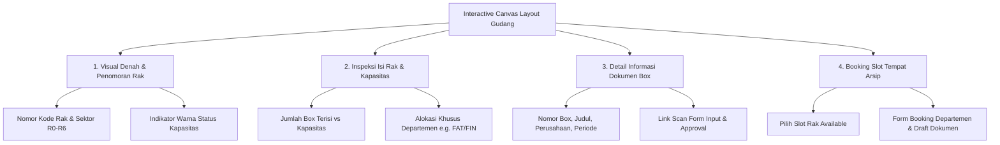

# Catatan Rencana Implementasi: Fitur Interactive Layout Gudang (Canvas 2D)

Dokumen ini berisi spesifikasi teknis, rancangan skema database, arsitektur *Interactive Canvas*, dan alur kerja (*workflow*) untuk fitur **Layout Gudang Arsip Interaktif** pada aplikasi **INDRACO Arsip (Document Management System - PT Indraco)** berdasarkan denah fisik [`image.png`](file:///C:/laragon/www/%23Project2026/indraco-arsip-laravel-10/image.png).

---

## 1. Ringkasan & Tujuan Fitur (Overview)

Fitur **Layout Gudang Interaktif** dirancang untuk memvisualisasikan seluruh denah ruangan dan susunan rak gudang fisik secara 2D menggunakan **HTML5 Canvas**. 

### Peta Ruangan & Sektor Utama (Berdasarkan Sketsa [`image.png`](file:///C:/laragon/www/%23Project2026/indraco-arsip-laravel-10/image.png)):
- **GUDANG GA** (Sektor Atas Tengah): Ruangan arsip General Affairs.
- **GUDANG IT** (Sektor Bawah Kiri): Ruangan arsip Teknologi Informasi.
- **Sektor R0** (Selasar Utama): Rak horisontal di tengah koridor utama.
- **Sektor R1** (Sektor Atas Kanan): Barisan rak vertikal (A, B, C, D, E, F) khusus dokumen FAT (Finance/Accounting).
- **Sektor R2** (Sektor Kanan Tengah): Rak vertikal dan horisontal tambahan (FAT).
- **Sektor R3 & R4** (Sektor Bawah Kanan): Barisan rak vertikal penyimpanan arsip umum.
- **Sektor R5** (Sektor Bawah Tengah): Barisan rak vertikal beserta fasilitas Toilet/t.l.
- **Sektor R6** (Sektor Bawah Kiri): Rak horisontal di bawah Gudang IT.
- **Area Fasilitas**: Akses Tangga (`Up`), Pintu Masuk Ruangan, dan Lorong Utama.

---

## 2. Fitur Utama Interactive Canvas (Key Features)



### A. Visual Denah & Penomoran Rak (Canvas Renderer)
1. **Interactive Canvas**: Merender denah 2D gudang secara presisi dengan visualisasi dinding, pintu, lorong, dan kotak-kotak rak.
2. **Penomoran & Labeling Kode Rak**:
   - Setiap elemen rak di canvas diberi label kode sektor dan nomor (misal: `R1-A`, `R1-B`, `R0-01`, `R5-C`).
   - Admin/PIC Gudang dapat menyesuaikan nomor rak dan kapasitas box langsung dari modal editor.
3. **Indikator Warna Keterisian (Capacity Color Coding)**:
   - 🟢 **Hijau (Kosong / < 50%)**: Kapasitas masih sangat luas.
   - 🔵 **Biru (Sedang / 50% - 85%)**: Kapasitas terisi sebagian.
   - 🟡 **Kuning (Booking / Reserved)**: Rak dalam alokasi booking departemen.
   - 🔴 **Merah (Penuh / > 90%)**: Rak terisi maksimal.

### B. Inspeksi Isi Rak (Rack Content Inspector)
- Mengeklik pada salah satu objek rak di canvas akan membuka **Drawer Side Panel / Modal Detail Rak**:
  - Nama Ruangan & Sektor (e.g. `Sektor R1 - Rak F (FAT)`).
  - Statistik Kapasitas: Terisi `X` dari `Y` Box (Persentase Keterisian).
  - Alokasi Departemen Pemilik (e.g. `FAT / Finance & Accounting`).
  - Daftar lengkap Box Arsip yang sedang tersimpan di rak tersebut.

### C. Detail Informasi Dokumen (Document Detail Modal)
- Mengeklik item box arsip dari daftar isi rak akan menampilkan **Pop-up Detail Dokumen**:
  - Nomor Kode Box Container (e.g. `BOX-FIN-2603-001`).
  - Judul / Nama Berkas Arsip.
  - Nama Perusahaan (`PT Indraco Global`, `PT Indraco Trading`, dll.).
  - Jenis Dokumen (`PR`, `ABSENSI`, `UTILITY`, `DATA SAMPLE`, `FAKTUR`, `KONTRAK`).
  - Periode YY-MM & Masa Simpan Expiry Retention.
  - Tautan langsung ke berkas scan Formulir Input & Approval.

### D. Booking Tempat Dokumen / Departemen (Slot Booking System)
- Pengguna / PIC Departemen dapat memilih slot rak yang berstatus *Available* dan klik **"Booking Tempat Arsip"**:
  - Mengisi Departemen Pemohon & Estimasi Jumlah Box.
  - Mengisi Judul Draft / Kategori Berkas yang akan dikirimkan.
  - Sistem akan mengunci slot rak tersebut dengan status **Booked (Kuning)** sehingga PIC Gudang dapat memverifikasi saat fisik berkas tiba.

---

## 3. Rancangan Skema Database (Migration Plan)

### A. Modifikasi Tabel `warehouse_locations`
Tambahkan kolom pendukung posisi canvas 2D dan atribut booking:

```php
Schema::table('warehouse_locations', function (Blueprint $table) {
    $table->string('room_sector', 50)->nullable()->after('warehouse_id'); // e.g. R0, R1, R2, GUDANG GA, GUDANG IT
    $table->integer('canvas_x')->default(0)->after('room_sector'); // Posisi X pada Canvas (px)
    $table->integer('canvas_y')->default(0)->after('canvas_x'); // Posisi Y pada Canvas (px)
    $table->integer('canvas_width')->default(60)->after('canvas_y'); // Lebar Rak pada Canvas (px)
    $table->integer('canvas_height')->default(120)->after('canvas_width'); // Tinggi Rak pada Canvas (px)
    $table->enum('orientation', ['horizontal', 'vertical'])->default('vertical')->after('canvas_height');
    $table->foreignId('assigned_department_id')->nullable()->after('box_capacity')->constrained('departments')->nullOnDelete(); // Alokasi khusus (e.g. FAT)
    $table->boolean('is_booked')->default(false)->after('assigned_department_id');
    $table->foreignId('booked_by_user_id')->nullable()->after('is_booked')->constrained('users')->nullOnDelete();
    $table->text('booking_notes')->nullable()->after('booked_by_user_id');
});
```

### B. Tabel Baru `warehouse_layout_settings` (Opsional untuk Layout Static Elements)
Menyimpan komponen lingkungan canvas (dinding, pintu, tangga, teks nama ruangan):

```php
Schema::create('warehouse_layout_settings', function (Blueprint $table) {
    $table->id();
    $table->foreignId('warehouse_id')->constrained('warehouses')->cascadeOnDelete();
    $table->longText('layout_json_data'); // Menyimpan geometri ruangan & teks dari image.png
    $table->timestamps();
});
```

---

## 4. Arsitektur Teknis Canvas & Antarmuka UI

### A. Teknologi Frontend Canvas
- **Library**: HTML5 Canvas API murni dengan pendamping **Fabric.js** atau **Konva.js** (dikombinasikan dengan TailwindCSS & Alpine.js).
- **Fitur Canvas Viewer**:
  - **Zoom & Pan**: Control zoom in/out dan drag pan untuk navigasi denah gudang yang luas.
  - **Click Event Listener**: Deteksi klik pada objek rak untuk membuka drawer detail.
  - **Department Filter**: Dropdown filter untuk menyorot (*highlight*) rak milik departemen tertentu (misal: sorot semua rak milik `FAT` atau `FIN`).

### B. Layout Antarmuka (Wireframe Conceptual)

```
+-----------------------------------------------------------------------------------+
|  HEADER: INTERACTIVE LAYOUT GUDANG ARSIP PT INDRACO                               |
|  [Filter Dept: Semua v] [Filter Expiry: Semua v] [Zoom: + - Reset] [Mode Edit]   |
+---------------------------------------------------------+-------------------------+
|                                                         | DRAWER INSPEKTOR RAK    |
|   +-------------------------------------------------+   |                         |
|   |  GUDANG GA      | R1 (A B C D E F - FAT)        |   | [Sektor R1 - Rak F]     |
|   |                 |                               |   | Status: 42/50 Box (84%) |
|   |-----------------+-------------------------------+   | Alokasi: FAT / Finance  |
|   |                 |                               |   |                         |
|   |  R0 (Koridor)   | R2 (Vertikal & Horisontal)    |   | DAFTAR BOX ARSIP:       |
|   |  [Rak Horisont] |                               |   | 1. BOX-FIN-2603-001     |
|   |                 |                               |   |    "Faktur Pajak Q1"    |
|   |-----------------+-------------------------------+   | 2. BOX-FIN-2603-002     |
|   | GUDANG IT | R6  | R5 (Toilet) | R4   | R3       |   |    "Kas Keluar Feb"     |
|   +-------------------------------------------------+   |                         |
|                                                         | [ + Booking Tempat ]    |
+---------------------------------------------------------+-------------------------+
```

---

## 5. Rencana Langkah Kerja Implementasi (Checklist)

- [ ] **Langkah 1**: Buat file migration untuk menambahkan kolom koordinat canvas, `room_sector`, `assigned_department_id`, dan status booking pada `warehouse_locations`.
- [ ] **Langkah 2**: Update Model `WarehouseLocation` & `Warehouse` untuk menambahkan atribut relasi dan accessor posisi canvas.
- [ ] **Langkah 3**: Buat Seeder Koordinat Layout Gudang berdasarkan gambar [`image.png`](file:///C:/laragon/www/%23Project2026/indraco-arsip-laravel-10/image.png) untuk memetakan Sektor R0, R1 (A-F), R2, R3, R4, R5, R6, Gudang GA, dan Gudang IT.
- [ ] **Langkah 4**: Buat Controller & Route khusus Layout Gudang (`WarehouseLayoutController` / `warehouse.layout`).
- [ ] **Langkah 5**: Buat View Blade Interactive Canvas (`resources/views/master/warehouse_layout.blade.php`) menggunakan HTML5 Canvas / Konva.js dengan fitur:
  - Render denah gudang 2D (Ruangan, Tangga, Toilet, Rak).
  - Hover & Click event listener pada objek rak.
  - Drawer Side Panel untuk menampilkan isi rak dan detail dokumen.
  - Modal Form Booking Tempat/Slot Rak untuk Departemen.
- [ ] **Langkah 6**: Pengujian interaktivitas canvas, filter departemen, penomoran rak, pengisian box, dan alur booking tempat.

---
*Dokumen perencanaan ini dibuat sebagai pedoman implementasi fitur Interactive Layout Gudang PT Indraco.*
