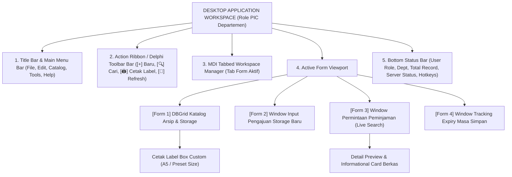
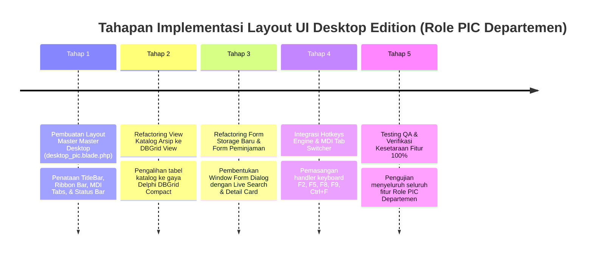

# Catatan Rencana Implementasi: Fitur Layout UI Desktop Application Style (Role PIC Departemen)

Dokumen ini berisi rancangan arsitektur antarmuka, spesifikasi komponen visual, skema penataan *Multiple Document Interface (MDI)*, serta alur kerja (*workflow*) untuk **Modifikasi Layout & UI Role PIC Departemen** pada aplikasi **INDRACO Arsip (Document Management System - PT Indraco)**.

Rancangan ini bertujuan untuk menguba tampilan antarmuka web standar pada role **PIC Departemen** menjadi **Aplikasi Desktop Enterprise (Desktop Form App)** bergaya klasik-modern yang mengadopsi estetika antarmuka khas **Delphi** dan **Visual Basic (Windows Forms / MDI Application)** tanpa merubah atau mengurangi **100% fitur bisnis yang sudah ada**.

---

## 1. Ringkasan & Tujuan Perubahan (Overview)

### A. Latar Belakang & Tujuan
Pengguna dengan role **PIC Departemen** memerlukan tingkat efisiensi tinggi, kepadatan data (*high data density*), kecepatan navigasi tanpa *mouse-lag*, serta kemudahan membaca informasi berkas secara ringkas. 

Transformasi layout ke versi **Desktop UI** akan memberikan pengalaman pengguna (*user experience*) yang familiar dengan aplikasi *desktop database* berbasis Windows (seperti Delphi / Visual Basic ERP Tools) dengan karakteristik:
- **Tampilan Terstruktur & Kompak**: Komponen rapat, minim spasi terbuang (*zero wasted space*), dan warna kontras tinggi.
- **MDI Tabbed Workspace**: Membuka beberapa modul/form secara simultan dalam *Tab Sheet* navigasi desktop.
- **Toolbar & Action Bar Delphi Style**: Tombol perintah dengan ikon khas desktop dan pemisah visual.
- **DataGrid View Spreadsheet Style**: Tabel data dengan indikator sortir, filter kolom, dan baris berselang-seling (*zebra striping*).
- **Pintasan Keyboard Lengkap (Hotkeys)**: Akses cepat menggunakan tombol `F2`, `F5`, `F9`, `Ctrl+F`, `Esc`.

### B. Prinsip Kesetaraan Fitur (100% Feature Parity Guarantee)
> [!IMPORTANT]
> Perubahan layout ini **hanya berfokus pada lapisan antarmuka visual (UI/UX)**. Seluruh logika bisnis, hak akses, validasi data, serta fitur untuk Role PIC Departemen **TETAP SAMA 100%**, mencakup:
> 1. Katalog & Booking Arsip Dokumen Departemen.
> 2. Form Pengajuan Storage Berkas Baru & Scan Lampiran.
> 3. Form Permintaan Peminjaman Dokumen (Live Search & Detail Preview).
> 4. Tracking Masa Simpan & Expiry Retention Dokumen.
> 5. Cetak Custom Label Box Container.
> 6. Log & Audit Trail Transaksi Departemen.

---

## 2. Arsitektur & Struktur Antarmuka Desktop (Mermaid Diagram)



---

## 3. Ciri Khas & Karakteristik Desain Desktop App (Delphi / Visual Basic Style)

Antarmuka **Desktop Edition** untuk Role PIC Departemen mengadopsi 6 elemen utama aplikasi desktop:

### 1. Title Bar & Menu Bar Klassik (Top Main Menu)
- Terletak pada bagian paling atas dengan bilah menu bertingkat:  
  `File` | `Catalog` | `Borrowings` | `Retention` | `Reports` | `Window` | `Help`
- Mengakomodasi perintah cepat dan perpindahan form.

### 2. Action Ribbon & Toolbar (Delphi Command Bar)
- Jajaran tombol perintah dengan ikon *flat-classic*, teks ringkas, dan *border shadow inset*:
  - `[+] Draft Baru (F2)`
  - `[🔍] Cari Berkas (Ctrl+F)`
  - `[🖨️] Cetak Label (F9)`
  - `[🔄] Segarkan Data (F5)`
  - `[📄] Peminjaman (F8)`
  - `[📊] Ekspor CSV`

### 3. MDI Tabbed Workspace (Multiple Document Interface)
- Memungkinkan PIC Departemen membuka beberapa halaman/form sekaligus dalam tab internal:
  - Tab 1: `📂 [Katalog Arsip FIN]`
  - Tab 2: `➕ [Pengajuan Storage Baru]`
  - Tab 3: `📝 [Form Peminjaman Berkas]`
- Pengguna dapat berpindah tab secara instan menggunakan mouse atau pintasan `Ctrl + Tab`.

### 4. Enterprise DBGrid View (Data Spreadsheet Style)
- Menggunakan komponen tabel terkompresi khas Delphi `TDBGrid` atau Visual Basic `MSFlexGrid`:
  - *Header Cell*: Abu-abu steel dengan indikator arah panah sortir 🛈.
  - *Grid Lines*: Garis pembatas sel yang tegas (`border-slate-300`).
  - *Zebra Striping*: Baris selang-seling warna putih dan abu-abu terang (`bg-slate-100/50`).
  - *Active Row Highlight*: Highlight baris terpilih dengan warna biru navy desktop (`bg-blue-600 text-white`).

### 5. Desktop Form Dialog Modal (Windows Form Window)
- Form input (`Pengajuan Storage`, `Form Peminjaman`) disajikan dalam jendela *floating modal window* yang dilengkapi:
  - *Window Title Bar* dengan tombol `[_] [□] [X]`.
  - Panel Form bergaris tegas (*Form Frame*).
  - Tombol Aksi Bawah: `[ Batal (Esc) ]` dan `[ Simpan / Kirim (Enter) ]`.

### 6. Bottom Status Bar (Windows Status Panel)
- Strip informasi bagian dasar layar yang memuat 4 panel indikator:
  - **Panel 1 (User)**: `PIC DEPT: Siti Finance Curator (FIN)`
  - **Panel 2 (Records)**: `Total Berkas: 128 Dokumen | Filter: Aktiv`
  - **Panel 3 (Hotkeys)**: `F2: Baru | F5: Refresh | F9: Cetak Label | Esc: Tutup`
  - **Panel 4 (Server)**: `🟢 Connected - DMS Server v1.0.0`

---

## 4. Spesifikasi Komponen & Modifikasi Kode Visual

### A. Master Layout Desktop (`resources/views/layouts/desktop_pic.blade.php`)

Skema layout master khusus untuk Role PIC Departemen:

```html
<!DOCTYPE html>
<html lang="id" class="h-full select-none">
<head>
    <meta charset="UTF-8">
    <title>INDRACO DMS - Desktop Edition (PIC Departemen)</title>
    <!-- CSS & Fonts -->
    <script src="https://cdn.tailwindcss.com"></script>
    <script defer src="https://cdn.jsdelivr.net/npm/alpinejs@3.x.x/dist/cdn.min.js"></script>
    <style>
        /* Custom Desktop Component Classes */
        .dbgrid-header { background: linear-gradient(180deg, #f8fafc 0%, #e2e8f0 100%); border-bottom: 2px solid #94a3b8; }
        .dbgrid-cell { border-right: 1px solid #cbd5e1; border-bottom: 1px solid #cbd5e1; font-family: 'Segoe UI', Tahoma, monospace; }
        .desktop-window { border: 2px solid #334155; box-shadow: 0 10px 25px -5px rgba(0,0,0,0.3); }
        .desktop-titlebar { background: linear-gradient(90deg, #1e293b 0%, #334155 100%); color: white; }
    </style>
</head>
<body class="h-full bg-slate-200 font-sans text-xs text-slate-900 flex flex-col overflow-hidden" x-data="desktopApp()">

    <!-- 1. TOP WINDOW TITLE BAR & MENU BAR -->
    <header class="bg-slate-900 text-white flex items-center justify-between px-3 py-1 text-xs border-b border-slate-700 shrink-0">
        <div class="flex items-center gap-4">
            <span class="font-black tracking-wider text-amber-400 flex items-center gap-1.5">
                🖥️ INDRACO DMS <span class="text-[10px] text-slate-300 font-normal">[Desktop Workstation]</span>
            </span>
            <!-- Top Menu Items -->
            <nav class="hidden md:flex items-center gap-3 text-slate-300 text-[11px]">
                <a href="#" class="hover:text-white">File</a>
                <a href="#" class="hover:text-white font-bold text-amber-300">Catalog</a>
                <a href="#" class="hover:text-white">Borrowings</a>
                <a href="#" class="hover:text-white">Retention</a>
                <a href="#" class="hover:text-white">Window</a>
                <a href="#" class="hover:text-white">Help</a>
            </nav>
        </div>
        <div class="text-[11px] text-slate-300 flex items-center gap-3">
            <span>PIC: <strong>{{ auth()->user()->name }}</strong> ({{ auth()->user()->department->code ?? 'DEPT' }})</span>
            <form action="{{ route('logout') }}" method="POST" class="inline">
                @csrf
                <button type="submit" class="text-rose-400 hover:text-rose-300 font-bold">[ Exit ]</button>
            </form>
        </div>
    </header>

    <!-- 2. DELPHI TOOLBAR ACTION RIBBON -->
    <div class="bg-slate-100 border-b border-slate-400 px-3 py-1.5 flex items-center justify-between shrink-0 shadow-xs">
        <div class="flex items-center gap-1.5">
            <a href="{{ route('archives.create') }}" class="px-2.5 py-1 bg-white hover:bg-slate-50 border border-slate-400 rounded text-slate-800 font-bold flex items-center gap-1 shadow-2xs">
                <span>➕ Baru (F2)</span>
            </a>
            <a href="{{ route('archives.index') }}" class="px-2.5 py-1 bg-white hover:bg-slate-50 border border-slate-400 rounded text-slate-800 font-bold flex items-center gap-1 shadow-2xs">
                <span>🔍 Cari (Ctrl+F)</span>
            </a>
            <a href="{{ route('archives.print_labels') }}" target="_blank" class="px-2.5 py-1 bg-white hover:bg-slate-50 border border-slate-400 rounded text-slate-800 font-bold flex items-center gap-1 shadow-2xs">
                <span>🖨️ Cetak Label (F9)</span>
            </a>
            <a href="{{ route('borrowings.create') }}" class="px-2.5 py-1 bg-white hover:bg-slate-50 border border-slate-400 rounded text-slate-800 font-bold flex items-center gap-1 shadow-2xs">
                <span>📝 Pinjam Dokumen (F8)</span>
            </a>
            <button onclick="window.location.reload()" class="px-2.5 py-1 bg-white hover:bg-slate-50 border border-slate-400 rounded text-slate-800 font-bold flex items-center gap-1 shadow-2xs">
                <span>🔄 Refresh (F5)</span>
            </button>
        </div>
        <div class="text-[11px] font-mono text-slate-600 font-bold">
            WORKSTATION ID: WS-FIN-01
        </div>
    </div>

    <!-- 3. MDI TAB SHEET NAVIGATION MANAGER -->
    <div class="bg-slate-300 px-2 pt-1 border-b border-slate-400 flex items-center gap-1 shrink-0">
        <a href="{{ route('archives.index') }}" class="px-3 py-1 rounded-t border-t border-x border-slate-400 font-bold text-xs {{ request()->routeIs('archives.*') ? 'bg-white text-slate-900 border-b-white -mb-px' : 'bg-slate-200 text-slate-600 hover:bg-slate-100' }}">
            📂 [Form 1] Katalog Arsip {{ auth()->user()->department->code ?? '' }}
        </a>
        <a href="{{ route('borrowings.index') }}" class="px-3 py-1 rounded-t border-t border-x border-slate-400 font-bold text-xs {{ request()->routeIs('borrowings.*') ? 'bg-white text-slate-900 border-b-white -mb-px' : 'bg-slate-200 text-slate-600 hover:bg-slate-100' }}">
            📑 [Form 2] Log Peminjaman Berkas
        </a>
        <a href="{{ route('destructions.index') }}" class="px-3 py-1 rounded-t border-t border-x border-slate-400 font-bold text-xs {{ request()->routeIs('destructions.*') ? 'bg-white text-slate-900 border-b-white -mb-px' : 'bg-slate-200 text-slate-600 hover:bg-slate-100' }}">
            ⏳ [Form 3] Retention & Expiry Status
        </a>
    </div>

    <!-- 4. ACTIVE FORM VIEWPORT (MAIN CONTENT AREA) -->
    <main class="flex-1 bg-white p-2 overflow-auto relative">
        @yield('content')
    </main>

    <!-- 5. WINDOWS BOTTOM STATUS BAR -->
    <footer class="bg-slate-800 text-slate-300 text-[11px] px-3 py-1 flex items-center justify-between border-t border-slate-700 shrink-0 font-mono">
        <div class="flex items-center gap-4">
            <span class="flex items-center gap-1 text-emerald-400">
                <span class="w-2 h-2 rounded-full bg-emerald-400 animate-pulse"></span> SYSTEM READY
            </span>
            <span>USER: {{ auth()->user()->name }} ({{ auth()->user()->department->code ?? 'DEPT' }})</span>
        </div>
        <div class="flex items-center gap-4 text-slate-400">
            <span>KEYS: F2:Baru | F5:Refresh | F8:Pinjam | F9:Cetak Label | Esc:Tutup</span>
            <span>DMS VER 1.0.0</span>
        </div>
    </footer>

</body>
</html>
```

---

## 5. Matriks Perbandingan Tampilan Web vs Desktop Edition

| Fitur / Modul | Tampilan Web Standar | Tampilan Desktop Edition (Delphi/VB Style) | Kesetaraan Fitur |
|:---|:---|:---|:---:|
| **Navigasi Utama** | Sidebar Kiri Melayang (*Collapsible Sidebar*) | Top TitleBar + Ribbon Toolbar + MDI Window Tabs | 100% Sama |
| **Tabel Katalog Arsip** | Web Table Spasi Luas (Tailwind Cards) | DBGrid Compact Spreadsheet (Gridlines, Sticky Header) | 100% Sama |
| **Pencarian & Filter** | Form Card Atas | Grid Integrated Search Panel (Pencarian Cepat `Ctrl+F`) | 100% Sama |
| **Form Storage Baru** | Halaman Form Standar Web | Window Form Dialog Modal dengan OK/Cancel Shortcut | 100% Sama |
| **Form Peminjaman** | Halaman Web terpisah | Dual-Panel Window Form (Live Search Autocomplete + Detail Card) | 100% Sama |
| **Cetak Label Box** | Halaman Preview Cetak | Custom Label Engine Window with Dimensions Selector | 100% Sama |
| **Status Bar** | Footer Web Biasa | Windows Multi-Panel Status Bar (Status, Records, Hotkeys) | 100% Sama |

---

## 6. Integrasi Pintasan Papan Ketik (Desktop Hotkeys Engine)

Untuk memberikan pengalaman penuh aplikasi desktop, engine pintasan keyboard ditambahkan pada layout `desktop_pic`:

```javascript
document.addEventListener('keydown', function(e) {
    // F2: Buka Form Pengajuan Storage Baru
    if (e.key === 'F2') {
        e.preventDefault();
        window.location.href = "{{ route('archives.create') }}";
    }
    // F5: Refresh Data Halaman
    else if (e.key === 'F5') {
        e.preventDefault();
        window.location.reload();
    }
    // F8: Buka Form Peminjaman Dokumen
    else if (e.key === 'F8') {
        e.preventDefault();
        window.location.href = "{{ route('borrowings.create') }}";
    }
    // F9: Buka Cetak Custom Label Box
    else if (e.key === 'F9') {
        e.preventDefault();
        window.open("{{ route('archives.print_labels') }}", '_blank');
    }
    // Ctrl + F: Focus ke Input Search
    else if (e.ctrlKey && e.key.toLowerCase() === 'f') {
        e.preventDefault();
        const searchInput = document.querySelector('input[name="search"], input[type="search"]');
        if (searchInput) searchInput.focus();
    }
});
```

---

## 7. Rencana Tahapan Implementasi (Implementation Roadmap)



### Tahap 1: Pembuatan Master Layout Desktop (`desktop_pic.blade.php`)
- Membuat berkas layout baru `resources/views/layouts/desktop_pic.blade.php`.
- Mengimplementasikan CSS styling kustom untuk DBGrid, Titlebar, MDI Tabs, dan Status Bar.

### Tahap 2: Pengalihan Layout Berdasarkan Role User (Layout Switcher)
- Pada `resources/views/layouts/app.blade.php` atau controller view renderer:
  - Jika user memiliki `role === 'pic_dept'`, otomatis menggunakan layout `@extends('layouts.desktop_pic')`.
  - Jika user `admin` atau `pic_gudang`, tetap menggunakan layout aplikasi web standar.

### Tahap 3: Penyempurnaan Tampilan Form PIC Departemen
- Meresetting tampilan `archives/index.blade.php`, `archives/create.blade.php`, `borrowings/index.blade.php`, dan `borrowings/create.blade.php` saat dirender dalam mode `desktop_pic`.

### Tahap 4: Testing & Verifikasi
- Pengujian fungsionalitas 100% kesetaraan fitur:
  - Submisi form storage & scan lampiran.
  - Live search peminjaman & detail preview berkas.
  - Cetak label box container A5 / custom size.
  - Pembatasan data khusus departemen terkait.

---

## 8. Kesimpulan & Hasil yang Diharapkan

Dengan selesainya implementasi dokumen perencanaan [`implementation_layout_ui_dekstop.md`](file:///c:/laragon/www/%23Project2026/indraco-arsip-laravel-10/implementation_layout_ui_dekstop.md):
1. Pengguna dengan **Role PIC Departemen** mendapatkan antarmuka **Desktop Application** yang sangat cepat, terstruktur, padat data (*high data density*), dan bebas dari ruang kosong web yang tidak perlu.
2. Seluruh **fitur bisnis dan keamanan departemen tetap 100% utuh dan berfungsi sempurna** tanpa ada penurunan kinerja atau perubahan logika backend.
3. Aplikasi **INDRACO DMS** memiliki fleksibilitas antarmuka ganda: tampilan Modern Web untuk Admin/Gudang dan tampilan Desktop Workstation untuk PIC Departemen.
