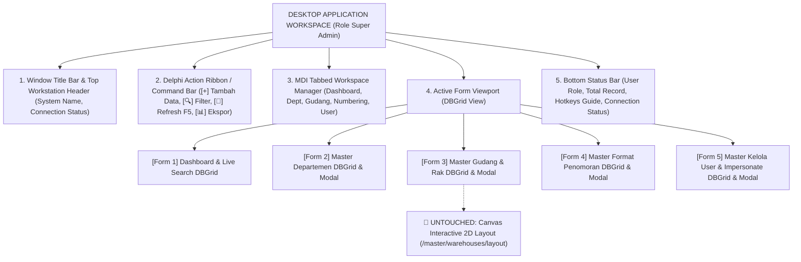

# Catatan Rencana Implementasi: Fitur Layout UI Desktop Application Style (Role Super Admin & Master Data) v2

Dokumen ini berisi rancangan arsitektur antarmuka, spesifikasi komponen visual, skema penataan *Multiple Document Interface (MDI)*, serta alur kerja (*workflow*) untuk **Modifikasi Layout & UI Role Super Admin (Master Data Management)** pada aplikasi **INDRACO Arsip (Document Management System - PT Indraco)**.

Rancangan ini bertujuan untuk mengubah tampilan antarmuka web standar pada role **Super Admin** dan modul **Master Data** menjadi **Aplikasi Desktop Enterprise (Desktop Form App)** bergaya klasik-modern yang mengadopsi estetika antarmuka khas **Delphi** dan **Visual Basic (Windows Forms / MDI Application)** tanpa merubah atau mengurangi **100% fitur bisnis yang sudah ada**.

---

## 1. Ringkasan & Tujuan Perubahan (Overview)

### A. Latar Belakang & Tujuan
Pengguna dengan role **Super Admin** memerlukan tingkat efisiensi tinggi, kepadatan data (*high data density*), kecepatan navigasi tanpa *mouse-lag*, serta kemudahan dalam mengelola data master departemen, gudang/rak, format penomoran, dan manajemen user/hak akses.

Transformasi layout ke versi **Desktop UI** akan memberikan pengalaman pengguna (*user experience*) yang familiar dengan aplikasi *desktop database* berbasis Windows (seperti Delphi / Visual Basic ERP Tools) dengan karakteristik:
- **Tampilan Terstruktur & Kompak**: Komponen rapat, minim spasi terbuang (*zero wasted space*), dan warna kontras tinggi.
- **MDI Tabbed Workspace**: Membuka beberapa modul/form secara simultan dalam *Tab Sheet* navigasi desktop.
- **Toolbar & Action Bar Delphi Style**: Tombol perintah dengan ikon khas desktop, status indicator, dan pemisah visual.
- **DataGrid View Spreadsheet Style**: Tabel data dengan indikator sortir, filter kolom, dan baris berselang-seling (*zebra striping*).
- **Pintasan Keyboard Lengkap (Hotkeys)**: Akses cepat menggunakan tombol `F2`, `F5`, `F8`, `Ctrl+F`, `Esc`.

---

## 2. Cakupan Halaman & Pengecualian (Target Scope & Exception)

### A. Halaman Target yang Dirubah ke Delphi / VB Desktop Style:
1. 🏠 **`http://127.0.0.1:8000/`** ([dashboard/index.blade.php](file:///C:/laragon/www/%23Project2026/indraco-arsip-laravel-10/resources/views/dashboard/index.blade.php)): Dashboard Overview & Global Live Search Arsip.
2. 🏢 **`http://127.0.0.1:8000/master/departments`** ([master/departments.blade.php](file:///C:/laragon/www/%23Project2026/indraco-arsip-laravel-10/resources/views/master/departments.blade.php)): Form DBGrid & Modal Input Master Departemen Perusahaan.
3. 📦 **`http://127.0.0.1:8000/master/warehouses`** ([master/warehouses.blade.php](file:///C:/laragon/www/%23Project2026/indraco-arsip-laravel-10/resources/views/master/warehouses.blade.php)): Form DBGrid & Modal Input Master Gudang, Blok, & Rak Storage.
4. 🔢 **`http://127.0.0.1:8000/master/numbering`** ([master/numbering.blade.php](file:///C:/laragon/www/%23Project2026/indraco-arsip-laravel-10/resources/views/master/numbering.blade.php)): Form DBGrid & Modal Setting Custom Engine Format Penomoran Box.
5. 👤 **`http://127.0.0.1:8000/master/users`** ([master/users.blade.php](file:///C:/laragon/www/%23Project2026/indraco-arsip-laravel-10/resources/views/master/users.blade.php)): Form DBGrid & Modal Input Kelola User, Peran (Role), & Login-As Impersonation.

### B. 🚫 Pengecualian Khusus (DO NOT MODIFY EXCEPTION):
> [!IMPORTANT]
> **PERHATIAN KHUSUS (EXPLICIT DIRECTIVE)**:
> Halaman **`http://127.0.0.1:8000/master/warehouses/layout`** ([master/warehouse_layout.blade.php](file:///C:/laragon/www/%23Project2026/indraco-arsip-laravel-10/resources/views/master/warehouse_layout.blade.php)) **TIDAK BOLEH DIRUBAH / TETAP SESUAI KODE YANG SUDAH ADA DAFTAR KANVAS 2D NYA**.

---

## 3. Arsitektur & Struktur Antarmuka Desktop Super Admin (Mermaid Diagram)

---

## 4. Ciri Khas & Karakteristik Desain Desktop App (Delphi / Visual Basic Style)

Antarmuka **Desktop Edition Super Admin** mengadopsi 6 elemen utama antarmuka desktop:

### 1. Title Bar & Workstation Header
- Window title bar bagian atas: `DMS PT Indraco - Workstation Desktop Edition [Super Admin]`
- Indikator status koneksi server `🟢 Connected` dan toggle theme button (`Light/Dark`).

### 2. Action Ribbon & Command Toolbar (Delphi Command Bar)
- Jajaran tombol perintah dengan ikon khas desktop dan *border shadow inset*:
  - `[+] Tambah Data Baru (F2)`
  - `[🔍] Pencarian Berkas & Master (Ctrl+F)`
  - `[🔄] Muat Ulang Data (F5)`
  - `[📊] Ekspor CSV / PDF`

### 3. MDI Tabbed Workspace (Multiple Document Interface)
- Navigasi tab sheet tingkat atas yang fleksibel:
  - Tab 1: `📊 [Dashboard Overview]`
  - Tab 2: `🏢 [Master Departemen]`
  - Tab 3: `📦 [Master Gudang & Rak]`
  - Tab 4: `🔢 [Format Penomoran]`
  - Tab 5: `👤 [Kelola User & Hak Akses]`
  - Tab 6: `🎨 [Layout Gudang 2D]` *(Point ke rute untouchable layout)*

### 4. Enterprise DBGrid View (Data Spreadsheet Style)
- Menggunakan komponen tabel terkompresi khas Delphi `TDBGrid` atau Visual Basic `MSFlexGrid`:
  - *Header Cell*: Abu-abu steel dengan indikator arah panah sortir 🛈.
  - *Grid Lines*: Garis pembatas sel yang tegas (`border-slate-300 dark:border-slate-700`).
  - *Zebra Striping*: Baris selang-seling warna putih dan abu-abu terang (`bg-slate-100/50 dark:bg-slate-900/50`).
  - *Active Row Highlight*: Highlight baris terpilih dengan warna biru/gold desktop (`bg-amber-500/20 dark:bg-amber-500/30 text-amber-900 dark:text-amber-200`).

### 5. Desktop Form Dialog Modal (Windows Form Window)
- Form input modal (`Tambah Departemen`, `Tambah Gudang/Rak`, `Format Penomoran`, `Tambah User`) disajikan dalam jendela *floating modal window* yang dilengkapi:
  - *Window Title Bar* dengan tombol `[_] [🗖] [✕]`.
  - Panel Form bergaris tegas (*Form Frame*).
  - Tombol Aksi Bawah: `[ Batal (Esc) ]` dan `[ Simpan (Enter) ]`.

### 6. Bottom Status Bar (Windows Status Panel)
- Strip informasi bagian dasar layar yang memuat 4 panel indikator:
  - **Panel 1 (User)**: `SUPER ADMIN: Super Admin (Global)`
  - **Panel 2 (Records)**: `Total Records: [Dynamic Count] Items`
  - **Panel 3 (Hotkeys)**: `F2: Baru | F5: Refresh | Esc: Tutup Modal | Ctrl+F: Cari`
  - **Panel 4 (Server)**: `🟢 Connected - DMS Server v1.0.0`

---

## 5. Rencana Perubahan Komponen & Layout File View

### A. Layout Master (`resources/views/layouts/app.blade.php`)
- Memperbarui layout master Super Admin agar mendukung komponen desktop frame, MDI tab sheet navigasi, status bar 4 panel, dan styling Delphi DBGrid.

### B. View Dashboard (`resources/views/dashboard/index.blade.php`)
- Mengubah tampilan widget statistik dan tabel katalog/live search ke bentuk **Delphi DBGrid Spreadsheet & Desktop Action Toolbar**.

### C. View Master Departemen (`resources/views/master/departments.blade.php`)
- Mengubah daftar departemen ke bentuk **Delphi TDBGrid** dan modal form tambah/edit departemen ke bentuk **Windows Form Dialog Modal**.

### D. View Master Gudang & Rak (`resources/views/master/warehouses.blade.php`)
- Mengubah daftar gudang, lokasi, dan rak penyimpanan ke bentuk **Delphi TDBGrid** dan modal dialog input gudang/rak.

### E. View Master Format Penomoran (`resources/views/master/numbering.blade.php`)
- Mengubah form konfigurasikan prefix, digit sequence, dan preview format penomoran box ke bentuk **Delphi TGroupBox & Desktop Form Controls**.

### F. View Master Kelola User (`resources/views/master/users.blade.php`)
- Mengubah tabel user dan badge peran/departemen ke bentuk **Delphi TDBGrid** serta modal dialog tambah/edit user dan tombol impersonate ke **Desktop SpeedButton Style**.

---

## 6. Rencana Verifikasi (Verification Plan)

### Manual Verification
1. **Navigasi Super Admin**: Login sebagai Super Admin (`admin@indraco.com` / `password`).
2. **Uji 5 Halaman Target**:
   - Buka `http://127.0.0.1:8000/` -> Cek tampilan Delphi Desktop Dashboard.
   - Buka `http://127.0.0.1:8000/master/departments` -> Cek Delphi DBGrid & Modal Input Departemen.
   - Buka `http://127.0.0.1:8000/master/warehouses` -> Cek Delphi DBGrid & Modal Input Gudang/Rak.
   - Buka `http://127.0.0.1:8000/master/numbering` -> Cek Delphi TGroupBox Format Penomoran.
   - Buka `http://127.0.0.1:8000/master/users` -> Cek Delphi DBGrid & Modal Input User & Impersonate.
3. **Uji Pengecualian Untouched**:
   - Buka `http://127.0.0.1:8000/master/warehouses/layout` -> Pastikan kanvas 2D interactive layout **100% TETAP SAMA DAN TIDAK DIRUBAH**.
4. **Uji Fungsionalitas Backend (100% Parity Check)**:
   - Lakukan pengujian CRUD (Tambah, Edit, Hapus) pada departemen, gudang, numbering, dan user. Pastikan seluruh transaksi database Laravel berjalan 100% sukses tanpa error.
