# Catatan Revisi & Rencana Implementasi Update 1: INDRACO Arsip

Dokumen ini berisi spesifikasi teknis, penyesuaian alur kerja (*workflow*), dan struktur data revisi untuk proyek **INDRACO Arsip (Document Management System - PT Indraco)**.

---

## 1. Ringkasan Revisi Sistem (Overview)

Aplikasi **INDRACO Arsip** diperbarui untuk memperketat alur persetujuan (*approval*), pencatatan berkas fisik, pencetakan stiker label box/container, serta penyediaan bukti fisik terarsip dalam bentuk scan formulir pada setiap tahapan (Input, Peminjaman, dan Pemusnahan).

---

## 2. Alur Proses Implementasi (Workflow)

```mermaid
flowchart TD
    subgraph ALUR_INPUT [1. Alur Pengajuan Input]
        A1[User Departemen: Input Draft Arsip & Metadata] --> A2[PIC Gudang: Menerima & Memvalidasi Draft]
        A2 -->|Valid| A3[PIC Gudang: Cetak Formulir Stiker Box / Container]
        A3 --> A4[Stiker Ditempel ke Box/Container & Disimpan di Rak]
    end

    subgraph ALUR_PINJAM [2. Alur Pengajuan Booking / Penarikan]
        B1[User Peminjam: Mengajukan Peminjaman Dokumen] --> B2[Approval Manager / PIC Departemen Pemilik Dokumen]
        B2 -->|Approved| B3[PIC Gudang: Validasi & Output Dokumen Fisik dari Rak]
        B3 --> B4[Dokumen Dikeluarkan & Catat Log Pinjam + Scan Formulir Approval]
    end

    subgraph ALUR_PEMUSNAHAN [3. Alur Pengajuan Pemusnahan]
        C1[Notifikasi Otomatis: Out of Date Periode Simpan / Expiry Alert] --> C2{Keputusan Departemen}
        C2 -->|Perpanjang| C3[Opsi Tambah Masa Simpan: Cetak Formulir Perpanjangan]
        C2 -->|Musnahkan| C4[User Departemen: Pengajuan Pemusnahan]
        C4 --> C5[Approval Departemen Pemilik Dokumen]
        C5 -->|Approved| C6[PIC Gudang: Approval Akhir & Eksekusi Pemusnahan]
        C6 --> C7[Upload Scan Dokumentasi BAP & Form Approval Pemusnahan]
    end
```

### A. Alur Pengajuan Input Dokumen
1. **Pengajuan Draft**: User per departemen membuat pengajuan input draft dokumen arsip baru melalui formulir input.
2. **Validasi PIC Gudang**: PIC Gudang menerima pengajuan draft dari departemen dan memeriksa kesesuaian fisik/metadata.
3. **Cetak Stiker Label Container**: Setelah divalidasi, PIC Gudang mencetak **Formulir Stiker Label Container/Box** untuk ditempelkan secara fisik pada box/container arsip sebelum diletakkan pada lokasi rak gudang (`Rack Number`).

### B. Alur Pengajuan Booking / Penarikan Dokumen (Peminjaman)
1. **Pengajuan Peminjaman**: User peminjam mengajukan peminjaman dokumen fisik/digital dengan mengisi spesifikasi berkas yang dibutuhkan.
2. **Approval Departemen**: Pengajuan harus mendapatkan persetujuan (*approval*) dari Kepala / PIC Departemen pemilik dokumen.
3. **Validasi & Pengeluaran Berkas Gudang**: Setelah disetujui departemen, PIC Gudang memvalidasi pengajuan dan mengeluarkan dokumen dari rak fisik gudang serta mencatat scan formulir bukti approval peminjaman.

### C. Alur Pengajuan Pemusnahan Dokumen (Retention & Destruction)
1. **Alert Out of Date**: Sistem mengirimkan notifikasi otomatis kepada User Departemen & PIC Gudang saat dokumen mencapai batas *periode simpan* (kadaluarsa).
2. **Alternatif Perpanjangan Masa Simpan**: Apabila dokumen masih dibutuhkan, disediakan fitur pengajuan perpanjangan masa simpan dilengkapi formulir cetak perpanjangan.
3. **Pengajuan & Double Approval Pemusnahan**:
   - User Departemen mengajukan pemusnahan dokumen.
   - Approval tingkat 1: Departemen pemilik dokumen mengonfirmasi pemusnahan.
   - Approval tingkat 2: PIC Gudang menyetujui dan mengeksekusi pemusnahan fisik.
4. **Dokumentasi BAP**: PIC Gudang mengunggah scan bukti dokumen Berita Acara Pemusnahan (BAP) dan scan formulir approval pemusnahan ke dalam sistem.

---

## 3. Struktur Data & Parameter Input (Data Schema)

Berikut adalah daftar atribut data wajib dan opsional yang dikelola pada aplikasi **INDRACO Arsip**:

| No | Atribut Data | Tipe Data | Deskripsi / Ketentuan |
| font-mono | --- | --- | --- |
| 1 | **Departemen** | Foreign Key | Relasi ke Master Departemen (HRD, FIN, MKT, LOG, dll.) |
| 2 | **Perusahaan** | String / Select | Nama Perusahaan / Entitas PT Indraco (contoh: *PT Indraco Global, PT Indraco Trading*) |
| 3 | **Periode Dokumen** | String (YY, MM) | Format Bulan dan Tahun dokumen (contoh: `26-03` untuk Maret 2026 atau `2026-03`) |
| 4 | **ID Container / Box** | String (Unique) | Auto-generated oleh Custom Numbering Engine (contoh: `BOX-FIN-2603-001`) |
| 5 | **Rack Number** | Foreign Key / String | Nomor Rak & Lokasi Fisik Penyimpanan di Gudang Arsip (contoh: `GUD-A/RAK-02/SLOT-05`) |
| 6 | **Tanggal Input** | DateTime | Tanggal dan waktu pengajuan/input dokumen ke sistem |
| 7 | **Masa Simpan** | Integer (Tahun) | Durasi simpan **maksimal 5 tahun** dihitung dari *Periode Dokumen* |
| 8 | **Jenis Dokumen** | String / Enum | Kategori berkas: `PR`, `ABSENSI`, `UTILITY`, `DATA SAMPLE`, `FAKTUR`, `KONTRAK`, dll. |
| 9 | **Dokumen Images Scan Formulir Input** | File Path (Image/PDF) | File scan formulir input/pendaftaran arsip fisik |
| 10 | **Login User / PIC** | Foreign Key | User penanggung jawab & role (`PIC Departemen`, `PIC Gudang`, `Super Admin`) |
| 11 | **Bukti Approval Input Dokumen** | File Path (Image/PDF) | Scan formulir persetujuan input berkas dari PIC/Manager |
| 12 | **Bukti Approval Peminjaman Dokumen** | File Path (Image/PDF) | Scan formulir persetujuan penarikan/peminjaman berkas |
| 13 | **Bukti Approval Pemusnahan Dokumen** | File Path (Image/PDF) | Scan formulir Berita Acara Pemusnahan (BAP) & persetujuan pemusnahan |

---

## 4. Gap Analysis & Rencana Modifikasi Database (Migration Plan)

Untuk mengakomodasi struktur data revisi di atas pada codebase Laravel 10 saat ini:

### A. Update Skema Tabel `archives`
- [ ] Tambahkan kolom `company_name` (String, nullable).
- [ ] Tambahkan kolom `document_type` (String, e.g. `PR`, `ABSENSI`, `UTILITY`, `DATA SAMPLE`).
- [ ] Modifikasi validasi `retention_years` agar strictly **maksimal 5 tahun** dari periode dokumen.
- [ ] Tambahkan kolom `period_yy_mm` (String, length 7, e.g. `26-03`).
- [ ] Tambahkan kolom `scan_input_form` (String/FilePath, scan formulir input).
- [ ] Tambahkan kolom `scan_approval_input` (String/FilePath, scan bukti approval input).

### B. Update Skema Tabel `borrowing_logs`
- [ ] Tambahkan kolom `department_approval_by` & `department_approved_at`.
- [ ] Tambahkan kolom `scan_approval_borrow` (String/FilePath, scan bukti approval peminjaman).

### C. Update Skema Tabel `destruction_logs`
- [ ] Tambahkan kolom `department_approval_by` & `department_approved_at`.
- [ ] Tambahkan kolom `scan_approval_destruction` (String/FilePath, scan bukti approval pemusnahan).
- [ ] Tambahkan fitur **Formulir Cetak Perpanjangan Masa Simpan** & kolom `extension_reason` / `scan_extension_form`.

### D. Fitur Cetak Stiker Box / Container
- [ ] Buat view khusus cetak stiker label box container (`/archives/{archive}/print-sticker`) berukuran standar barcode/stiker box yang berisi QR/Barcode ID Container, Nomor Rak, Nama Departemen, Periode Dokumen, dan Tanggal Expiry.

---

## 5. Rencana Langkah Kerja (Implementation Checklist)

- [ ] **Langkah 1**: Buat file migration update untuk menambah kolom baru pada `archives`, `borrowing_logs`, dan `destruction_logs`.
- [ ] **Langkah 2**: Update Model `Archive`, `BorrowingLog`, dan `DestructionLog` beserta `$fillable` dan relasinya.
- [ ] **Langkah 3**: Update Form Tambah/Edit Arsip (`resources/views/archives/create.blade.php`) untuk memasukkan field Perusahaan, Jenis Dokumen (PR, ABSENSI, UTILITY, DATA SAMPLE), Periode YY-MM, pembatasan Masa Simpan max 5 tahun, dan upload Scan Formulir Input & Approval Input.
- [ ] **Langkah 4**: Tambahkan halaman & layout cetak stiker box container (`resources/views/archives/print_sticker.blade.php`).
- [ ] **Langkah 5**: Update workflow peminjaman & pemusnahan untuk mendukung 2-step approval (Departemen -> PIC Gudang) serta upload scan formulir bukti approval.
- [ ] **Langkah 6**: Pengujian akhir alur input, cetak stiker, peminjaman, dan pemusnahan.

---
*Dokumen ini dibuat sebagai acuan utama eksekusi revisi sistem INDRACO Arsip.*
