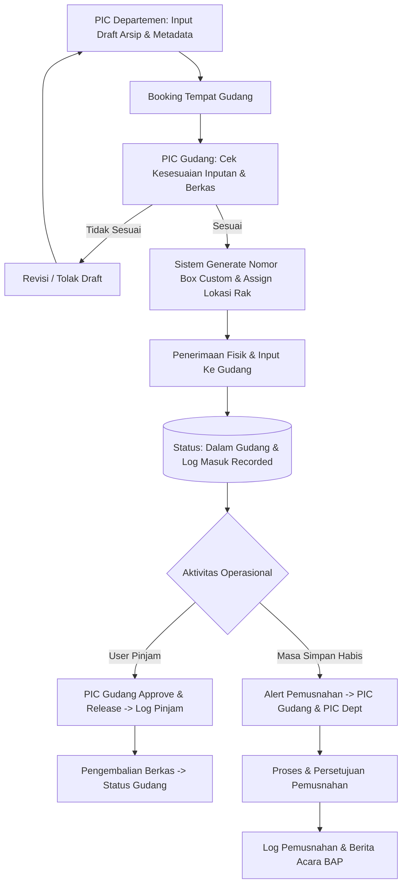

# Plan Master: Aplikasi Document Management System (DMS) / Sistem Arsip PT Indraco

## 1. Pendahuluan & Ringkasan Proyek
Aplikasi **Document Management System (DMS) / Sistem Manajemen & Gudang Arsip PT Indraco** dirancang untuk mengelola siklus hidup fisik dan digital dokumen/arsip perusahaan secara terpusat, aman, dan teratur. 
Sistem ini memfasilitasi setiap departemen di PT Indraco dalam pencatatan draft dokumen, pemesanan (booking) lokasi penyimpanan di gudang arsip, penomoran box otomatis berformat custom, peminjaman dokumen, hingga pengawasan masa simpan dan alur pemusnahan dokumen.

* **Lokasi Project:** `C:\laragon\www\#Project2026\indraco-arsip-laravel-10`
* **Logo Perusahaan:** `C:\laragon\www\#Project2026\indraco-arsip-laravel-10\logo-indraco-est.png`
* **Tech Stack Utama:** Laravel 10, Tailwind CSS, Alpine.js / Blade Components, MySQL / MariaDB.

---

## 2. Struktur Pengguna & Peran (Role & Access Control)
Sistem memiliki 3 tingkat hak akses utama:

1. **Super Admin / Management**
   - Mengatur Master Data (Departemen, Gudang, Rak/Baris, Format Penomoran, User & Role).
   - Melihat seluruh analisis, laporan arsip, statistik peminjaman, dan log aktivitas global.

2. **PIC Departemen (User Client Departemen)**
   - Menginput draft pengajuan arsip dokumen milik departemennya.
   - Mengisi metadata: Nama Departemen, Periode (cth: *Januari - Maret 2026*), Rincian Isi Berkas, dan Masa Simpan (Tahun/Tanggal Pemusnahan).
   - Mengajukan **Booking Tempat Storage Gudang**.
   - Mengajukan **Permintaan Peminjaman Dokumen** fisik/digital.
   - Mengakses katalog & riwayat arsip khusus departemennya.

3. **PIC Gudang (Warehouse Curator / Specialist)**
   - Dashboard Khusus Gudang untuk monitoring antrean pengajuan arsip masuk.
   - **Verifikasi & Cek Kesesuaian:** Memeriksa kesesuaian input data dengan fisik berkas/format.
   - **Penomoran Box/Arsip:** Memberikan/mengonfirmasi Nomor Box Arsip berdasarkan format custom yang dikonfigurasi.
   - **Check-in & Penempatan Gudang:** Memasukkan data lokasi fisik (Gudang, Rak, Baris, Box) dan mencatat **Log Masuk Gudang**.
   - **Manajemen Peminjaman:** Memproses pengajuan pinjam (persetujuan, pengeluaran berkas, pengembalian) dan mencatat **Log Pinjam**.
   - **Manajemen Pemusnahan:** Memantau jadwal pemusnahan (Alert Masa Simpan Expiry), mengonfirmasi Berita Acara Pemusnahan (BAP), dan mencatat **Log Pemusnahan**.

---

## 3. Fitur Utama & Alur Kerja (Workflow)

### A. Pengajuan & Booking Tempat Gudang
- User Departemen membuat usulan berkas arsip.
- Input data: Nama Departemen, Periode (cth: Januari - Maret 2026), Detail Isi Berkas, Masa Simpan (cth: 3 Tahun, 5 Tahun, Permanen), Upload scan berkas (opsional).
- Melakukan booking slot lokasi penyimpanan gudang.

### B. Verifikasi Data & Custom Penomoran Box Arsip
- PIC Gudang melakukan *checking validation*.
- Generator Nomor Box Arsip otomatis berbasis format template yang dapat disesuaikan (Dynamic Custom Box Code Engine).
  * *Contoh Format Code:* `{COMPANY}/{DEPT}/{YEAR}/{ROMAN_MONTH}/{COUNTER_BOX}` -> `IND/FIN/2026/III/0012-B`
  * Format dapat dikonfigurasi melalui menu setting Admin tanpa ubah koding.

### C. Manajemen Log (Audit Trail Log)
1. **Log Masuk Gudang:** Mencatat tgl masuk, PIC Gudang penerima, asal departemen, lokasi fisik (Gudang A, Rak 02, Baris B, Box 12).
2. **Log Pinjam:** Mencatat peminjam, alasan pinjam, tgl pinjam, estimasi pengembalian, status pengeluaran berkas, tgl realisasi pengembalian, & verifikasi PIC Gudang.
3. **Log Pemusnahan:** Mencatat daftar dokumen kadaluarsa, tgl pemusnahan, nomor Berita Acara Pemusnahan (BAP), lampiran dokumen BAP, dan eksekutor.

### D. Sistem Alert Masa Simpan & Pemusnahan
- Modul pemberitahuan otomatis (Dashboard Widget + Notification List) untuk dokumen yang mendekati tanggal kadaluarsa (*retention expiry date*).
- Status penandaan otomatis: *Aktif* -> *Mendekati Pemusnahan (Warning)* -> *Jatuh Tempo Pemusnahan* -> *Dimusnahkan*.

---

## 4. Perancangan Skema Database (Database Schema)

### 1) Table: `departments`
- `id` (PK, BigInt)
- `code` (Varchar 10, e.g., 'FIN', 'HRD', 'MKT', 'LOG')
- `name` (Varchar 100)
- `description` (Text, Nullable)
- `timestamps`

### 2) Table: `users`
- `id` (PK, BigInt)
- `name` (Varchar 255)
- `email` (Varchar 255, Unique)
- `password` (Varchar 255)
- `department_id` (FK -> `departments.id`, Nullable for PIC Gudang / Super Admin)
- `role` (Enum: 'admin', 'pic_dept', 'pic_gudang')
- `phone` (Varchar 20, Nullable)
- `timestamps`

### 3) Table: `warehouses` & `warehouse_locations`
- `warehouses`: `id`, `code`, `name`, `address`, `timestamps`
- `warehouse_locations`: 
  - `id` (PK)
  - `warehouse_id` (FK)
  - `rack_code` (Varchar 20, e.g., 'RAK-A1')
  - `shelf_code` (Varchar 20, e.g., 'BARIS-03')
  - `box_capacity` (Int)
  - `current_box_count` (Int)

### 4) Table: `numbering_formats`
- `id` (PK)
- `name` (Varchar 100) -> e.g., "Format Default Box Arsip"
- `pattern` (Varchar 255) -> e.g., `{COMPANY}/{DEPT}/{YEAR}/{BOX_SEQ}`
- `current_counter` (Int)
- `padding` (Int, default: 4)
- `is_active` (Boolean)

### 5) Table: `archives` (Tabel Utama Dokumen/Arsip)
- `id` (PK, BigInt)
- `box_number` (Varchar 100, Unique, Generated) -> Nomor Box Arsip
- `department_id` (FK -> `departments.id`)
- `created_by_user_id` (FK -> `users.id`)
- `title` (Varchar 255) -> Nama / Judul Berkas
- `period_start_date` (Date)
- `period_end_date` (Date)
- `period_text` (Varchar 100) -> e.g. "Januari - Maret 2026"
- `content_description` (Text) -> Isi Berkas
- `retention_years` (Int) -> Masa Simpan dalam tahun
- `retention_expiry_date` (Date) -> Tanggal Pemusnahan
- `physical_condition` (Varchar 100) -> e.g. "Baik / Softcover / Hardcover"
- `file_path` (Varchar 255, Nullable) -> Digital scan file attachment
- `warehouse_location_id` (FK -> `warehouse_locations.id`, Nullable)
- `status` (Enum: 'draft', 'pending_verification', 'approved_booked', 'in_warehouse', 'borrowed', 'pending_destruction', 'destroyed')
- `rejection_note` (Text, Nullable)
- `timestamps`

### 6) Table: `warehouse_entry_logs` (Log Masuk Gudang)
- `id` (PK)
- `archive_id` (FK -> `archives.id`)
- `pic_gudang_id` (FK -> `users.id`)
- `location_id` (FK -> `warehouse_locations.id`)
- `entry_date` (Datetime)
- `notes` (Text, Nullable)
- `timestamps`

### 7) Table: `borrowing_logs` (Log Pinjam Arsip)
- `id` (PK)
- `archive_id` (FK -> `archives.id`)
- `borrower_user_id` (FK -> `users.id`)
- `pic_gudang_id` (FK -> `users.id`, Nullable)
- `request_date` (Datetime)
- `borrow_date` (Datetime, Nullable)
- `expected_return_date` (Date)
- `actual_return_date` (Datetime, Nullable)
- `purpose` (Text)
- `status` (Enum: 'requested', 'approved', 'dispatched', 'returned', 'rejected')
- `notes` (Text, Nullable)
- `timestamps`

### 8) Table: `destruction_logs` (Log Pemusnahan)
- `id` (PK)
- `archive_id` (FK -> `archives.id`)
- `proposed_by_user_id` (FK -> `users.id`) -> PIC Gudang
- `approved_by_dept_pic_id` (FK -> `users.id`, Nullable) -> PIC Departemen
- `bap_number` (Varchar 100) -> Nomor Berita Acara Pemusnahan
- `destruction_date` (Date)
- `method` (Varchar 100) -> e.g. "Pencacahan", "Pembakaran Standard"
- `certificate_file` (Varchar 255, Nullable) -> File Upload BAP
- `notes` (Text, Nullable)
- `timestamps`

---

## 5. Rencana Desain Antarmuka (UI/UX - Tailwind CSS)
Sistem akan dibalut dengan desain modern berpola corporate profesional PT Indraco (Warna Dominan: *Navy Blue, Gold Accent, Clean Neutral Background*):

1. **Top Navbar & Branding Header**
   - Menampilkan logo resmi PT Indraco (`logo-indraco-est.png`).
   - Identitas User logged-in, Role Tag, & Quick Notification Alert.

2. **Dashboard Overview (Per Role)**
   - *Stat Cards:* Total Box Active, Total Berkas Departemen, Antrean Booking Gudang, Berkas Dipinjam, Alert Waktu Pemusnahan.
   - *Chart:* Distribusi Arsip per Departemen & Grafik Peminjaman Bulanan.

3. **Modul Pengajuan & Catalog Arsip (PIC Departemen)**
   - Form Wizard Input Draft Arsip dengan Datepicker Periode (Jan-Mar 2026).
   - Modal Booking Lokasi & Status Tracker Badge (`Draft`, `Menunggu Verifikasi`, `Approved`, `Dalam Gudang`).

4. **Modul Gudang & Verification Hub (PIC Gudang)**
   - Antrean Verifikasi Kesesuaian Berkas.
   - Modal Generator Custom Nomor Box.
   - Matrix Visual Lokasi Rak Gudang (Visual Slot Box).

5. **Modul Log & Audit Trail**
   - Tabbed Interface: Log Masuk Gudang, Log Peminjaman, Log Pemusnahan.
   - Fitur Filter Tanggal, Departemen, Search Quick Keywords, & Export PDF/Excel.

---

## 6. Tahapan Eksekusi Pengembangan (Implementation Phases)

### Fase 1: Setup Framework & UI Template (H1 - H2)
- Inisialisasi Laravel 10 & konfigurasi environment local (Laragon).
- Install & Konfigurasi Tailwind CSS, Vite, Alpine.js, Lucide Icons.
- Setup Layout Template (Sidebar, Navbar dengan Logo Indraco, Footer).
- Setup Migration Database & Model Relationships.
- Setup Seeder (Super Admin, PIC Gudang, PIC Dept FIN/HRD/PROD, Master Gudang & Formatter).

### Fase 2: Autentikasi & Dynamic Role Management (H3)
- Authentication System (Login, Logout, Reset Password).
- Middleware authorization (`CheckRole:admin,pic_dept,pic_gudang`).

### Fase 3: Modul Master & Format Code Engine (H4)
- CRUD Departemen & Master Gudang/Rak.
- Custom Code Engine Generator (`NumberingService` untuk format nomor box).

### Fase 4: Modul Arsip & Workflow Booking Departemen (H5 - H7)
- Form Draft Arsip (Nama Dept, Periode, Isi Berkas, Masa Simpan).
- Workflow Booking Tempat Gudang.
- Modul Verifikasi & Approval oleh PIC Gudang (Pengecekan kesesuaian berkas & pemberian nomor box).

### Fase 5: Modul Operasional Gudang & Log System (H8 - H10)
- Modul Check-in Gudang & Penempatan Rak (**Log Masuk Gudang**).
- Modul Peminjaman & Pengembalian Arsip (**Log Pinjam**).
- Modul Expiry Cron/Scheduler & Notifikasi Pemusnahan (**Log Pemusnahan & Berita Acara BAP**).

### Fase 6: Testing, Refinement, & Dokumentasi (H11 - H12)
- Unit Testing & Feature Testing alur persetujuan & pencatatan log.
- Penyesuaian responsif UI Tailwind.
- Finalisasi Panduan Pengguna & Handover.

---

## 7. Rencana Verifikasi & Pengujian (Verification Plan)

### A. Pengujian Fitur & Workflow (Manual Verification)
1. **Pengujian Form Draft & Booking (PIC Dept):**
   - Buat arsip baru dengan periode `Januari - Maret 2026`, pilih masa simpan 5 tahun.
   - Verifikasi status berubah menjadi `pending_verification`.
2. **Pengujian Verifikasi & Penomoran (PIC Gudang):**
   - Login sebagai PIC Gudang, selesaikan verifikasi data.
   - Verifikasi apakah nomor box otomatis ter-generate sesuai format custom yang aktif.
3. **Pengujian Log Masuk Gudang:**
   - Masukkan lokasi rak `RAK-A1-BARIS-02`.
   - Cek apakah entri tercatat otomatis pada `warehouse_entry_logs`.
4. **Pengujian Alur Peminjaman (Borrowing Log):**
   - PIC Dept mengajukan pinjam -> PIC Gudang approve & dispatch -> status `borrowed`.
   - Kembalikan berkas -> status `in_warehouse` -> riwayat lengkap di `borrowing_logs`.
5. **Pengujian Alert Pemusnahan (Destruction Log):**
   - Simulasi dokumen yang mencapai `retention_expiry_date`.
   - Cek kemunculan notifikasi/alert di dashboard PIC Gudang & PIC Dept.
   - Eksekusi pemusnahan & lampirkan BAP -> riwayat tercatat di `destruction_logs`.

---
*Dokumen plan ini dibuat sebagai panduan utama eksekusi proyek DMS PT Indraco di `C:\laragon\www\#Project2026\indraco-arsip-laravel-10`.*
